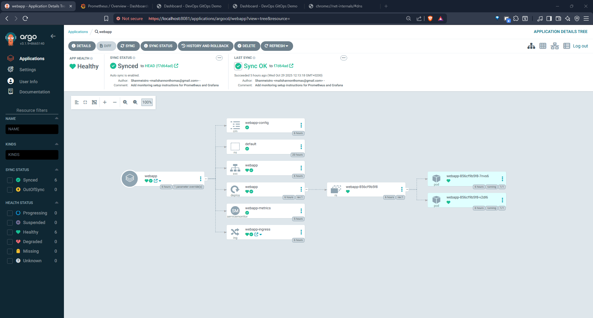
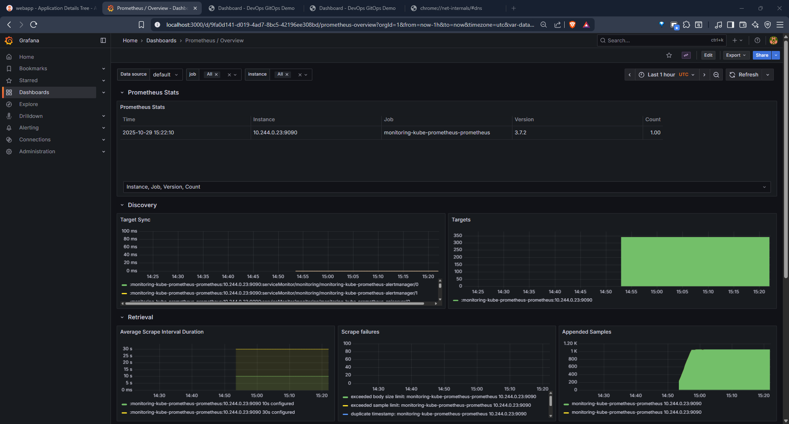

# DevOps GitOps Infrastructure

This repository contains production-ready Kubernetes manifests and ArgoCD configurations for deploying a Flask web application using GitOps principles.

## Overview

This infrastructure repository is designed to work with the [devops-gitops-pipeline](https://github.com/Shanmeistro/devops-gitops-pipeline) application repository, which contains a Flask web application with monitoring capabilities, health checks, and Prometheus metrics.

## Repository Structure

```
├── apps/webapp/              # Kubernetes manifests for the web application
│   ├── deployment.yaml       # Production-ready deployment with health checks
│   ├── service.yaml          # Service configuration
│   ├── configmap.yaml        # Application configuration
│   ├── servicemonitor.yaml   # Prometheus metrics scraping
│   ├── ingress.yaml          # External access configuration
│   ├── namespace.yaml        # Namespace definition
│   └── kustomization.yaml    # Kustomize configuration
├── argo-app.yaml             # ArgoCD application definition
├── kubernetes-setup.md       # Complete setup guide
└── README.md                 # This file
```

## Application Features

The deployed Flask application includes:

- **Health Monitoring**: `/health` and `/ready` endpoints for Kubernetes probes
- **Metrics Collection**: Prometheus metrics exposed at `/metrics`
- **Production Security**: Non-root user, security contexts, resource limits
- **High Availability**: Multiple replicas with rolling updates
- **External Access**: Ingress configuration for web traffic
- **Configuration Management**: Environment-specific settings via ConfigMap

## Quick Start

### Prerequisites

- Kubernetes cluster (local or cloud)
- kubectl configured
- ArgoCD installed

### 1. Set up Kubernetes Cluster

For detailed instructions, see [kubernetes-setup.md](kubernetes-setup.md). Quick options:

**Using kind:**
```bash
# Install kind and kubectl (see kubernetes-setup.md for details)
kind create cluster --name webapp-cluster
```

**Using k3d:**
```bash
# Install k3d (see kubernetes-setup.md for details)
k3d cluster create webapp-cluster --port "8080:80@loadbalancer"
```

### 2. Install ArgoCD

```bash
kubectl create namespace argocd
kubectl apply -n argocd -f https://raw.githubusercontent.com/argoproj/argo-cd/stable/manifests/install.yaml

# Wait for ArgoCD to be ready
kubectl wait --for=condition=available --timeout=300s deployment/argocd-server -n argocd

# Get admin password
kubectl -n argocd get secret argocd-initial-admin-secret -o jsonpath="{.data.password}" | base64 -d
```

### 3. Deploy the Application

```bash
# Apply the ArgoCD application
kubectl apply -f argo-app.yaml

# Access ArgoCD UI
kubectl port-forward svc/argocd-server -n argocd 8081:443
# Visit: https://localhost:8081 (username: admin, password from step 2)

> **Note:** ArgoCD UI and the webapp cannot both run on port 8080. Use port 8081 for both to avoid conflicts.
```

### 4. Access the Application

```bash
# Via port-forward
kubectl port-forward svc/webapp 8081:80

# Visit: http://localhost:8081

> **Note:** Ensure you are not running ArgoCD UI and the webapp on the same port.
```

## Kubernetes Manifests Details

### Deployment Configuration

The deployment includes:
- **Health Checks**: Liveness and readiness probes
- **Resource Management**: CPU (100m-500m) and memory (128Mi-512Mi) limits
- **Security**: Non-root user (1000), dropped capabilities
- **Environment**: Production configuration via ConfigMap
- **Monitoring**: Prometheus scraping annotations

### Service Configuration

- **Type**: ClusterIP for internal access
- **Ports**: HTTP traffic on port 80 → 8080 (container)
- **Labels**: Comprehensive labeling for service discovery

### Ingress Configuration

- **Controller**: NGINX ingress controller
- **Hosts**: `webapp.local` and wildcard paths
- **Health Checks**: Integrated with application health endpoints
- **SSL**: Configurable redirect policies

### Monitoring Setup

- **ServiceMonitor**: Automatic Prometheus metrics collection
- **Metrics Endpoint**: `/metrics` exposed by the Flask application
- **Scrape Interval**: 30 seconds with 10-second timeout

## GitOps Workflow

1. **Code Changes**: Developers push to [devops-gitops-pipeline](https://github.com/Shanmeistro/devops-gitops-pipeline)
2. **CI/CD Pipeline**: Builds and pushes container image to `ghcr.io/shanmeistro/devops-gitops-pipeline`
3. **GitOps Sync**: ArgoCD monitors this repository for manifest changes
4. **Automatic Deployment**: ArgoCD syncs changes to the Kubernetes cluster
5. **Self-Healing**: ArgoCD ensures desired state matches actual state

## Configuration Management

### Environment Variables

The application supports these key environment variables (managed via ConfigMap):

- `ENVIRONMENT`: Deployment environment (production/staging/development)
- `DEBUG`: Debug mode toggle
- `LOG_LEVEL`: Logging verbosity
- `METRICS_ENABLED`: Enable/disable Prometheus metrics
- `APP_VERSION`: Application version
- `BUILD_TIME`: Build timestamp
- `COMMIT_SHA`: Git commit hash

### Customization

To customize the deployment:

1. **Update ConfigMap**: Modify `apps/webapp/configmap.yaml`
2. **Scale Replicas**: Adjust `replicas` in `apps/webapp/deployment.yaml`
3. **Resource Limits**: Modify `resources` section in deployment
4. **Ingress Rules**: Update `apps/webapp/ingress.yaml` for different hosts/paths

## Monitoring and Observability

### Health Checks

- **Liveness Probe**: `GET /health` - ensures container is running
- **Readiness Probe**: `GET /ready` - ensures container can serve traffic

### Metrics

The application exposes Prometheus metrics at `/metrics` including:
- Request counts and duration
- System resource usage
- Custom application metrics

### Logging

Application logs are available via:
```bash
kubectl logs -f deployment/webapp
kubectl logs -f -l app=webapp
```

---

### Monitoring Setup: Prometheus & Grafana

#### 1. Install Helm

Helm is required for deploying monitoring tools. Install Helm on Linux:
```bash
curl -fsSL https://raw.githubusercontent.com/helm/helm/main/scripts/get-helm-3 | bash
```

#### 2. Deploy Prometheus & Grafana

Add the Helm repo and install the kube-prometheus-stack:
```bash
helm repo add prometheus-community https://prometheus-community.github.io/helm-charts
helm repo update
helm install monitoring prometheus-community/kube-prometheus-stack --namespace monitoring --create-namespace
```

#### 3. Access Grafana

Get the Grafana admin password:
```bash
kubectl --namespace monitoring get secrets monitoring-grafana -o jsonpath="{.data.admin-password}" | base64 -d ; echo
```

Port-forward Grafana to your local machine:
```bash
export POD_NAME=$(kubectl --namespace monitoring get pod -l "app.kubernetes.io/name=grafana,app.kubernetes.io/instance=monitoring" -oname)
kubectl --namespace monitoring port-forward $POD_NAME 3000
```

Open Grafana at [http://localhost:3000](http://localhost:3000) and log in with username `admin` and the password from above.

#### 4. Import Dashboards & Configure Alerts

Grafana is preconfigured to use Prometheus as a data source. You can import dashboards for Kubernetes and application monitoring, and set up alerting rules in Prometheus as needed.

For more details, see [kube-prometheus-stack documentation](https://github.com/prometheus-operator/kube-prometheus).

## Troubleshooting

### Expected Outcome if configured correctly

Webapp UI:


ArgoCD UI:


Webapp Metrics with Grafana and Prometheus:


### Confirm ArgoCD, ingress, webapp, and monitoring services are running

Services Status:


Pod Logs for webapp:


### Hosts File (WSL 2)

If running on WSL 2, update your hosts file in both Windows and WSL environments:

```
127.0.0.1 webapp.local
```

### Browser Compatibility

ArgoCD UI and the webapp are recommended for Chromium-based browsers (e.g., Brave) to avoid security certificate issues. Firefox may require strict permissions when running both interfaces.

### Debugging Tips

- Include screenshots of errors or browser issues when reporting problems.
- Check browser console for certificate warnings.
- Use `kubectl describe` and `kubectl logs` for deeper diagnostics.

### Common Issues

1. **Pod Not Starting**:
   ```bash
   kubectl describe pod <pod-name>
   kubectl logs <pod-name>
   ```

2. **Image Pull Errors**: Verify image exists at `ghcr.io/shanmeistro/devops-gitops-pipeline:latest`

3. **Service Not Accessible**: Check service and ingress configuration
   ```bash
   kubectl get svc,ingress
   kubectl describe ingress webapp-ingress
   ```

4. **ArgoCD Sync Issues**: Check application status in ArgoCD UI

### Useful Commands

```bash
# Validate manifests
kubectl kustomize apps/webapp

# Check all resources
kubectl get all -l app=webapp

# View events
kubectl get events --sort-by=.metadata.creationTimestamp

# Check ArgoCD application
kubectl get applications -n argocd
```

## Security Considerations

- **Non-root Execution**: Container runs as user ID 1000
- **Read-only Root Filesystem**: Configured where possible
- **Dropped Capabilities**: All unnecessary Linux capabilities removed
- **Network Policies**: Can be added for additional network isolation
- **Resource Limits**: Prevents resource exhaustion attacks

## Contributing

1. Make changes to Kubernetes manifests
2. Validate with `kubectl kustomize apps/webapp`
3. Test in development environment
4. Submit pull request
5. ArgoCD will sync changes automatically after merge

## Related Repositories

- **Application Code**: [devops-gitops-pipeline](https://github.com/Shanmeistro/devops-gitops-pipeline)
- **Container Images**: [GitHub Container Registry](https://ghcr.io/shanmeistro/devops-gitops-pipeline)

## Support

For detailed setup instructions and troubleshooting, see [kubernetes-setup.md](kubernetes-setup.md).

See [CHANGELOG.md](CHANGELOG.md) for version history and updates.
